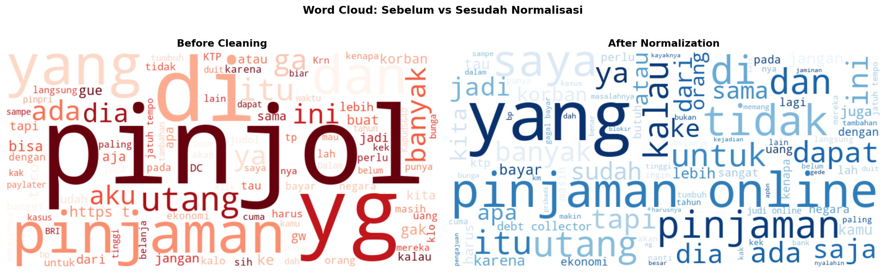

# Analisis Sentimen Opini Publik terhadap Pinjaman Online di Media Sosial

> **Menggunakan Logistic Regression dengan Normalisasi Bahasa Gaul**  
> Perbandingan Model: Logistic Regression | Naive Bayes | SVM Linear | Random Forest | XGBoost

[](https://python.org)
[](https://jupyter.org)
[](https://colab.research.google.com)
[](LICENSE)

---

## Deskripsi Dataset

Dataset ini berisi **2.500 tweet berbahasa Indonesia** yang membahas pinjaman online (pinjol) dari platform Twitter/X. Data dikumpulkan menggunakan `tweet-harvest` dengan kata kunci terkait pinjol, gagal bayar, debt collector, dan istilah terkait lainnya. Setiap tweet telah melalui pipeline preprocessing otomatis yang mencakup pembersihan noise, normalisasi bahasa gaul menggunakan kamus slang domain-spesifik (80+ entri), dan pelabelan sentimen berbasis keyword (negatif/positif/netral).

**Kontribusi utama penelitian ini:**
1. Kamus slang domain-spesifik konteks pinjaman online (80+ entri) dalam format `.csv` dan `.json`
2. Pipeline preprocessing lengkap dari raw tweet hingga siap model
3. Perbandingan 5 model machine learning dengan evaluasi komprehensif

---

## Informasi Dataset

| Keterangan | Detail |
|------------|--------|
| Sumber | Twitter/X (`tweet-harvest`) |
| Kata kunci scraping | `pinjol`, `galbay`, `pinjaman online`, `debt collector`, dll. |
| Total tweet | **2.500 tweet** |
| Bahasa | Indonesia + Bahasa Gaul/Slang |
| Label | `negatif` (~48%), `positif` (~26%), `netral` (~25%) |

### Kolom Dataset

| Kolom | Deskripsi |
|-------|-----------|
| `full_text` | Teks tweet asli hasil scraping |
| `clean` | Teks setelah cleaning (hapus URL, mention, hashtag, emoji) |
| `normalized` | Teks setelah normalisasi bahasa gaul |
| `label` | Sentimen: `negatif` / `positif` / `netral` |

---

## Struktur Folder

```
analisis-sentimen-pinjol/
│
├── data/
│   ├── raw/
│   │   └── dataset_pinjol_raw.csv           ← file CSV asli yang masih kotor
│   └── processed/
│       ├── dataset_pinjol_clean.csv          ← setelah cleaning
│       ├── dataset_pinjol_normalized.csv     ← setelah normalisasi slang
│       ├── dataset_pinjol_labeled.csv        ← siap dimasukkan ke ML
│       └── sample_validasi_manual.csv        ← 100 sampel validasi manual
│
├── dictionary/
│   ├── slang_dictionary.csv                 ← kamus kata gaul → formal
│   └── slang_dictionary.json               ← format JSON (bisa langsung diimpor)
│
├── scripts/
│   └── Tugas_Besar_DIP_Final_REVISED.ipynb  ← kode preprocessing + modeling
│
├── outputs/
│   ├── wordcloud_comparison.png             ← before vs after normalisasi
│   ├── distribusi_label.png                 ← distribusi label sentimen
│   ├── perbandingan_model.png               ← grafik perbandingan 5 model
│   ├── confusion_matrix_lr.png              ← confusion matrix LR
│   ├── confusion_matrix_all.png             ← confusion matrix semua model
│   ├── feature_importance_lr.png            ← kata paling berpengaruh
│   └── hasil_perbandingan_model.csv         ← tabel hasil evaluasi
│
└── README.md
```

---

## Model yang Dibandingkan

| No | Model | Tipe | Alasan Dipilih |
|----|-------|------|----------------|
| 1 | **Logistic Regression**  | Linear | Model utama sesuai judul, interpretable, probabilistik |
| 2 | **Naive Bayes** | Probabilistik | Baseline klasik NLP, ringan, standar di jurnal teks |
| 3 | **SVM Linear** | Margin-based | Sering terbaik untuk teks high-dimensional |
| 4 | **Random Forest** | Ensemble | Tahan overfitting, mewakili model ensemble |
| 5 | **XGBoost** | Gradient Boosting | Akurasi tinggi, sering unggul di data teks/tabular |

> Semua model menggunakan **TF-IDF (unigram + bigram, 5000 fitur)** sebagai representasi teks.  
> Evaluasi menggunakan **5-Fold Cross Validation**.

---

## Alur Pipeline (Minggu 1–16)

| Minggu | Tahap | Aktivitas |
|--------|-------|-----------|
| 1–2 | Crawling Data | Scraping Twitter/X dengan `tweet-harvest`, 5 batch × 500 tweet |
| 3–4 | Data Profiling | Cek duplikat, identifikasi noise (URL, mention, hashtag, emoji), frekuensi kata |
| 4–6 | Data Cleaning | Lowercase, hapus URL/mention/hashtag/emoji/simbol, filter tweet < 3 kata |
| 7–8 | Normalisasi Slang | Kamus 80+ entri, ubah bahasa gaul ke formal, validasi integrity |
| 9–10 | Labeling Sentimen | Keyword-based labeling (negatif/positif/netral) |
| 11–12 | Validasi & Dokumentasi | Validasi manual 100 sampel, wordcloud sebelum vs sesudah |
| 13–14 | Pemodelan | Training + evaluasi 5 model, confusion matrix, feature importance |
| 13–14 | Draft Jurnal | Abstrak, metodologi, deskripsi data, nilai guna (SINTA 4/5) |
| 15–16 | Finalisasi | Struktur folder GitHub, upload, submit jurnal |

---

## Langkah-Langkah Menjalankan Kode

### A. Google Colab (Rekomendasi)

1. Buka [Google Colab](https://colab.research.google.com)
2. Klik **File → Upload notebook**
3. Upload file `scripts/Tugas_Besar_DIP_Final_REVISED.ipynb`
4. Upload `dataset_pinjol_raw.csv` saat diminta
5. Jalankan cell **dari atas ke bawah** secara berurutan

### B. VS Code / Lokal

```bash
# 1. Clone repository
git clone https://github.com/USERNAME/analisis-sentimen-pinjol.git
cd analisis-sentimen-pinjol

# 2. Install dependensi
pip install -r requirements.txt

# 3. Buka notebook
jupyter notebook scripts/Tugas_Akhir_DIP_C.ipynb
```

### C. Gunakan Model yang Sudah Dilatih

```python
import pickle, re

# Load model dan tools
with open('model_logistic_regression.pkl', 'rb') as f:
    model = pickle.load(f)
with open('tfidf_vectorizer.pkl', 'rb') as f:
    tfidf = pickle.load(f)
with open('label_encoder.pkl', 'rb') as f:
    le = pickle.load(f)

def predict(text):
    text = re.sub(r'http\S+|@\w+|#\w+|[^a-zA-Z\s]', '', text.lower()).strip()
    vec  = tfidf.transform([text])
    pred = model.predict(vec)[0]
    return le.inverse_transform([pred])[0]

# Contoh
print(predict("pinjol membantu banget, cepat cair"))     # → positif
print(predict("galbay pinjol, dc terus nelpon ancam"))   # → negatif
print(predict("ada info pinjaman online terbaru?"))      # → netral
```

---

## Visualisasi Word Cloud

Word cloud di bawah menunjukkan perbandingan kata yang muncul **sebelum** dan **sesudah** proses normalisasi bahasa gaul.

| Before Cleaning | After Normalisasi |
|:-:|:-:|
|  | *(dalam satu gambar, lihat file `outputs/wordcloud_comparison.png`)* |

> File lengkap: `outputs/wordcloud_comparison.png`

---

## Metrik Evaluasi

| Metrik | Penjelasan |
|--------|-----------|
| **Accuracy** | Proporsi prediksi benar dari seluruh data |
| **Precision** | Ketepatan prediksi per kelas (weighted average) |
| **Recall** | Kelengkapan prediksi per kelas (weighted average) |
| **F1-Score** | Harmonic mean precision & recall — metrik utama |
| **CV Mean** | Rata-rata akurasi 5-fold cross-validation |
| **CV Std** | Standar deviasi CV — indikator stabilitas model |

---

## Requirements

```
pandas>=1.5.0
numpy>=1.23.0
scikit-learn>=1.2.0
xgboost>=1.7.0
matplotlib>=3.6.0
seaborn>=0.12.0
wordcloud>=1.9.0
imbalanced-learn>=0.10.0
```

Install sekaligus:
```bash
pip install -r requirements.txt
```

---

## Nilai Guna Dataset

Dataset dan kamus slang yang dihasilkan dapat dimanfaatkan untuk:

1. **Pelatihan Model Analisis Sentimen** — dataset berlabel siap digunakan sebagai data latih model ML maupun deep learning (IndoBERT, LSTM)
2. **Pengembangan Kamus Normalisasi** — `slang_dictionary.json` dapat diimpor langsung oleh peneliti lain yang bekerja dengan data Twitter berbahasa Indonesia
3. **Studi Persepsi Publik & Kebijakan** — mendukung analisis tren opini masyarakat terhadap fintech untuk kebijakan OJK
4. **Pengembangan Chatbot Edukasi Keuangan** — label sentimen dan keyword domain-spesifik dapat digunakan untuk melatih chatbot atau sistem rekomendasi pinjaman online

---

## Informasi

**Mata Kuliah:** Data, Informasi, dan Pengetahuan  
**Judul:** Analisis Sentimen Opini Publik terhadap Pinjaman Online di Media Sosial Menggunakan Logistic Regression dengan Normalisasi Bahasa Gaul

---

## Referensi

- Pedregosa et al. (2011). Scikit-learn: Machine Learning in Python. *JMLR, 12*, 2825–2830.
- Bird, S., Klein, E., & Loper, E. (2009). *Natural Language Processing with Python*. O'Reilly.
- OJK. (2023). *Statistik Fintech Lending*. Otoritas Jasa Keuangan Indonesia.
- Mahendra, R. et al. (2021). *IndoNLU: Benchmark and Resources for Evaluating Indonesian NLP*. AACL.
